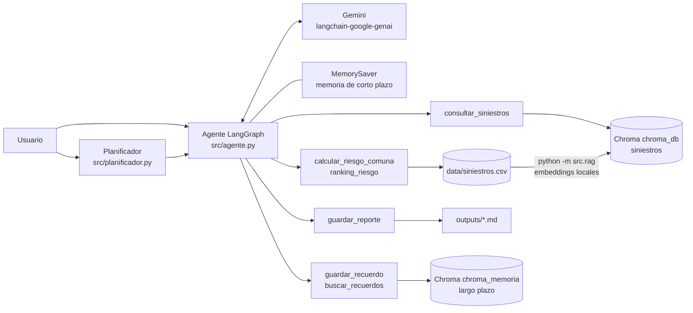
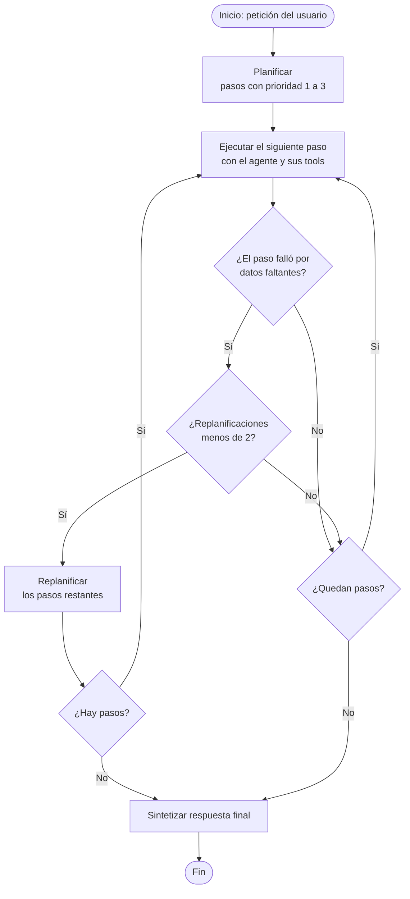
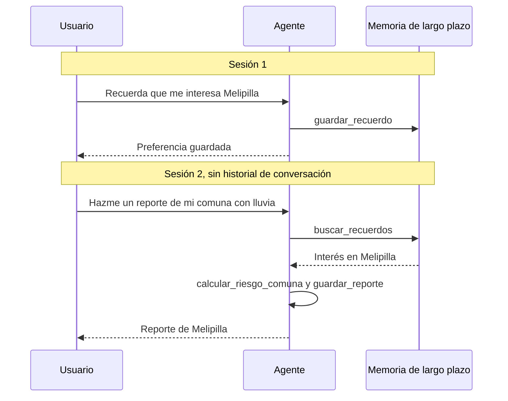

# Diagramas del sistema

## 1. Arquitectura general

```mermaid
flowchart LR
    U["Usuario"] --> P["Planificador<br/>src/planificador.py"]
    U --> A
    P --> A["Agente LangGraph<br/>src/agente.py"]
    A <--> LLM["Gemini<br/>langchain-google-genai"]
    A --- M["MemorySaver<br/>memoria de corto plazo"]
    A --> T1["consultar_siniestros"]
    A --> T2["calcular_riesgo_comuna<br/>ranking_riesgo"]
    A --> T3["guardar_reporte"]
    A --> T4["guardar_recuerdo<br/>buscar_recuerdos"]
    T1 --> C1[("Chroma chroma_db<br/>siniestros")]
    T2 --> D[("data/siniestros.csv")]
    T3 --> O["outputs/*.md"]
    T4 --> C2[("Chroma chroma_memoria<br/>largo plazo")]
    D -->|"python -m src.rag<br/>embeddings locales"| C1
```

## 2. Flujo del planificador con replanificación

```mermaid
flowchart TD
    S(["Inicio: petición del usuario"]) --> PL["Planificar<br/>pasos con prioridad 1 a 3"]
    PL --> E["Ejecutar el siguiente paso<br/>con el agente y sus tools"]
    E --> Q{"¿El paso falló por<br/>datos faltantes?"}
    Q -- No --> R{"¿Quedan pasos?"}
    Q -- Sí --> L{"¿Replanificaciones<br/>menos de 2?"}
    L -- Sí --> RP["Replanificar<br/>los pasos restantes"]
    L -- No --> R
    RP --> R2{"¿Hay pasos?"}
    R2 -- Sí --> E
    R2 -- No --> SI
    R -- Sí --> E
    R -- No --> SI["Sintetizar respuesta final"]
    SI --> F(["Fin"])
```

## 3. Memoria de largo plazo entre sesiones

```mermaid
sequenceDiagram
    participant U as Usuario
    participant A as Agente
    participant M as Memoria de largo plazo
    Note over U,M: Sesión 1
    U->>A: Recuerda que me interesa Melipilla
    A->>M: guardar_recuerdo
    A-->>U: Preferencia guardada
    Note over U,M: Sesión 2, sin historial de conversación
    U->>A: Hazme un reporte de mi comuna con lluvia
    A->>M: buscar_recuerdos
    M-->>A: Interés en Melipilla
    A->>A: calcular_riesgo_comuna y guardar_reporte
    A-->>U: Reporte de Melipilla
```